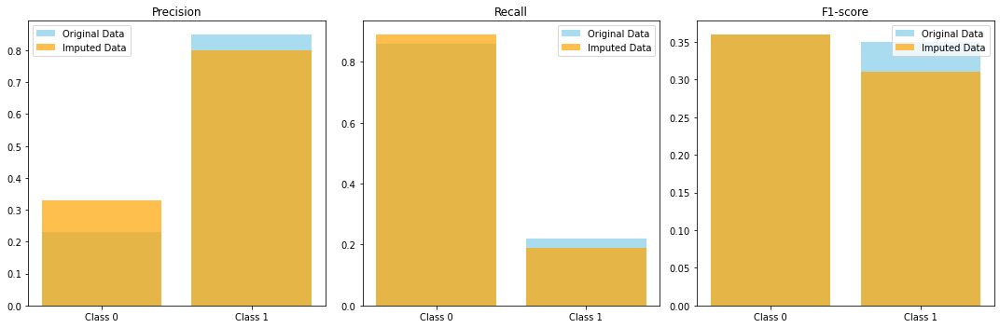

**Project Overview:**  

This project focuses on utilizing machine learning techniques, specifically XGBoost, to predict stock performance based on over 200 financial indicators extracted from 10-K filings of US publicly traded stocks. 
By leveraging this rich dataset spanning from 2018 to 2024, we aim to investigate the feasibility of using financial indicators for informed investment decisions. 

**Data Description:**  

This dataset repository consists of the following CSV files, each containing financial data for US stocks from 2014 to 2018:  

- 2014_Financial_Data.csv  
- 2015_Financial_Data.csv  
- 2016_Financial_Data.csv  
- 2017_Financial_Data.csv  
- 2018_Financial_Data.csv  

Each dataset includes over 200 financial indicators commonly found in yearly 10-K filings of publicly traded companies. On average, there are approximately 4,000 stocks listed in each dataset. The dataset was compiled using the Financial Modeling Prep API and pandas_datareader.

 

**Data Characteristics:**  

- Missing Values: Some financial indicator values are missing (NaN cells), allowing users to choose appropriate cleaning techniques such as dropna or fillna.  

- Outliers: Outliers, likely caused by mistypings, are present in the datasets. Users can decide on cleaning methods, considering percentile values (1% - 99%).  

- Sector Information: The third-to-last column, "Sector," categorizes each stock into sectors such as Basic Materials, Communication Services, Consumer Cyclical, and more. This facilitates sector-based analyses and comparisons.  

- Price Variation: The second-to-last column, "PRICE VAR [%]," indicates the percent price variation of each stock for the year. The last column, "class," provides binary classification for each stock:  

  - Class 1: Indicates stocks that should be bought at the start of the year and sold at the end for a profit (positive price variation).  

  - Class 0: Indicates stocks that should not be bought, as their value is predicted to decrease (negative price variation).  
  
**Preprocessing Steps:**  

Before analysis, the dataset underwent preprocessing steps, including:  

- Exploratory Data Analysis: Examining the structure of the data to understand its format and characteristics.  

- Label Correction: Correcting errors in labeling and checking for inconsistencies in the target variable.

**Methodology**

**XGBoost Overview:**

XGBoost, short for Extreme Gradient Boosting, is an efficient and scalable implementation of gradient boosting machines. It is a powerful machine learning algorithm known for its speed and performance in handling structured/tabular data. XGBoost works by sequentially adding decision trees to an ensemble, where each subsequent tree corrects the errors made by the previous ones. It incorporates regularization techniques to prevent overfitting and is capable of handling missing values and nonlinear relationships in the data.

**Data Preprocessing:**

The first step in our methodology was preprocessing the data. We addressed missing values by calculating the percentage of missing values in each feature for each year's data. Features with a significant amount of missing values were filtered out. Leveraging domain knowledge in economics, we further pruned features and employed mean, median, and mode imputation strategies to reduce bias and improve model performance. Additionally, we identified and handled significant outliers in the data.

**Model Training:**

We then trained the XGBoost model, accounting for temporal dependencies in the data by creating lag features of the target variable. The data was split into training and testing sets, with data from 2014 to 2017 used for training and data from 2018 used for testing. Hyperparameter tuning was performed using GridSearch to find the best-performing model configuration.

**Model Evaluation:**

Finally, we evaluated the best model on the test set to assess its performance. We computed metrics such as accuracy, precision, recall, and F1-score to measure the model's effectiveness in predicting stock performance based on financial indicators.

This methodology allowed us to effectively preprocess the data, train a robust XGBoost model, and evaluate its performance, ultimately providing insights into the predictive power of financial indicators for stock performance.  

**Results:**  

**Original Data:**
- The model achieved an accuracy of 0.36, indicating that it correctly predicted the class label for approximately 36% of instances in the test set. 
- Precision for Class 0 (stocks not worth buying) was low at 0.23, while recall was relatively high at 0.86. This suggests that the model correctly identified stocks to avoid, but it cast a broad net, leading to a significant number of false negatives.
- For Class 1 (stocks worth buying), precision was higher at 0.85, indicating that the model was often correct when predicting a stock as worthy. However, recall was low at 0.22, indicating that the model missed many instances of actual positives.

**Imputed Data:**
- After imputing missing values, the model's accuracy improved to 0.50, with noticeable improvements in precision and recall for both classes.
- Precision for Class 0 increased to 0.30, while recall remained high at 0.84, indicating better performance in identifying stocks to avoid.
- For Class 1, precision decreased slightly to 0.87, while recall improved marginally to 0.40, indicating a better balance between correctly identifying worthy stocks and avoiding false positives.

**Interpretation:**
- The XGBoost model exhibited risk-averse behavior, with a cautious approach in predicting stock performance. It demonstrated a tendency to identify stocks as not worth buying, leading to a high precision for Class 0 but low recall. Conversely, while the model correctly identified some worthy stocks (Class 1), it missed many positive instances, resulting in a low recall score.
- Despite its pessimistic tendencies, the model showed promise in identifying truly worthy stocks when it made positive predictions, as evidenced by its high precision score. However, further optimization may be required to improve recall and achieve a more balanced performance.
  

**Discussion:**

Upon reviewing the results, it is evident that the XGBoost model demonstrates a risk-averse and cautious approach in classifying stocks. While its tendency to identify stocks as not worth buying (Class 0) may mitigate the risk of investing in underperforming stocks, it also presents a challenge in potentially missing out on profitable investment opportunities. Particularly noteworthy is the model's performance in terms of recall for Class 1, which suggests opportunities for improvement to capture more instances of worthy stocks.

Moving forward, enhancing the model's predictive power could be achieved by incorporating additional features or refining existing ones. Exploring alternative machine learning algorithms and ensemble methods may also yield valuable insights into the intricate relationship between financial indicators and stock performance.

In summary, while the XGBoost model shows promise in predicting stock performance, there is room for refinement and optimization to address the identified limitations. By iteratively improving the model and leveraging advanced modeling techniques, we can strive to deliver more robust predictions, thereby empowering investors with valuable insights for informed decision-making in the dynamic financial landscape.

**Project Author:**:  
Daniel Ruan  

